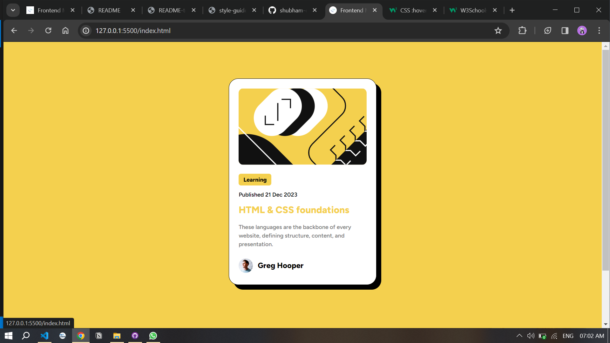
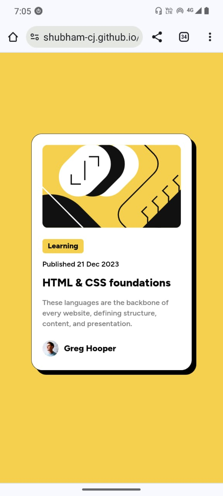

# Frontend Mentor - Blog preview card solution

This is a solution to the [Blog preview card challenge on Frontend Mentor](https://www.frontendmentor.io/challenges/blog-preview-card-ckPaj01IcS). Frontend Mentor challenges help me improve my coding skills by building realistic projects. 

## Table of contents

- [Overview](#overview)
  - [The challenge](#the-challenge)
  - [Screenshot](#screenshot)
  - [Links](#links)
- [My process](#my-process)
  - [Built with](#built-with)
  - [What I learned](#what-i-learned)
  - [Continued development](#continued-development)
  - [Useful resources](#useful-resources)
- [Author](#author)
- [Aknowledgements](#aknowledgements)

## Overview

### The challenge

Users should be able to:

- See hover and focus states for all interactive elements on the page

### Screenshot
###### Desktop screenshot -

###### Mobile screenshot -


### Links

- Solution URL: [click here to see my solution](https://www.frontendmentor.io/solutions/css-grid-for-responsive-page-flexbox-to-add-text-and-img-in-single-line-4blCk_99s1)
- Live Site URL: [click here to see live site](https://shubham-cj.github.io/blog-preview-card/)

## My process

### Built with

- Semantic HTML5 markup
- CSS custom properties
- CSS Grid
- Mobile-first workflow

### What I learned
While working on this project, I used my knowledge of CSS Grids and become more proficient in it. 
I used 16-Grids system to build the webpage. And different different media queries to make it responsive to screen sizes.

```css
body {
    font-family: "figtree";
    background: hsl(47, 88%, 63%);
    display: grid;
    grid-template-columns: repeat(16, 1fr);
    height: 120vh;
}
```
```css
@media screen and (min-width: 500px){}
@media screen and (min-width: 1400px){}
```

### Continued development

I will definitely work on CSS-Flexbox

### Useful resources

- [w3schools](https://www.example.com) - This helped me for CSS part.

## Author

- Website - [Shubham Jagtap](https://shubhamcj.ccbp.tech/)
- Frontend Mentor - [@shubham-cj](https://www.frontendmentor.io/profile/shubham-cj)
- Twitter - [@tw_shubhamCJ](https://twitter.com/tw_shubhamCJ)

## Aknowledgements

I really appreciate and thanking to Frontend Mentor community member [Marcose Travaglini](https://www.frontendmentor.io/profile/Blackpachamame) for helping to get rid of errors in this project. Thank a lot.